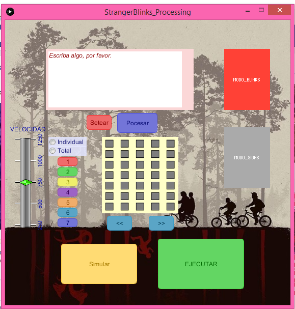

# StrangerBlinks
Mediante una GUI controlar unas luces led a través de arduino para dar mensajes de una forma original 

Integrantes:
Brito Casanova Orlando,
Joshua Zambrano Rosales,
Huacón Salazar Linda,

#INFORME # 1#

#ROLES SCRUM DE LOS INTEGRANTES#

A continuación se describen los roles de los integrantes de acuerdo al método de trabajo ágil SCRUM.

***
###PRODUCT OWNER###
**Orlando Brito:**

Como Product Owner tiene la funcion de encargarse de "vender" el producto al ciente, es decir se encarga de describir el funcionamiento de la aplicación, los componentes utilizados, la fomar en se elaboró etc.

###SCRUM MASTER###
**Linda Huacón:**

El ScrumMaster no es el líder del equipo (porque ellos se auto-organizan), sino que actúa como una protección entre el equipo y cualquier influencia que le distraiga. El ScrumMaster se asegura de que el proceso Scrum se utiliza como es debido. El ScrumMaster es el que hace que las reglas se cumplan. Adicional a esto es master es el encargado de reportarle al Owner mediante los informes de progreso.   

###SCRUM TEAM###
**Joshua Rosales:**

Pertenece al grupo de programadores con los conocimientos técnicos necesarios para desarrollar el proyecto llevando a cabo las especificaciones previamente establecidas.
Principalmente su rol dentro del team estará enfocado en la programación del código de toda la aplicación.

***

#DESCRIPCIÓN DE LA APLICACIÓN#

Se trata de una matriz de LED's con dimensiones de 7x5 controlada por una aplicación mediante el uso del arduino MEGA, donde se podrá utilizar bajo dos modos de operación:
 
1. **Modo Letrero**

	En este modo como su nombre lo indica los LED's se encienden y forman un letrero en el que las letras pasan una a una. 

2. **Modo Blinks**

	En este modo cada LED representa una letra y al elegirse una letra se enciende su LED correspondiente.

Posteriormente se ampliará este tema.
 
En cuanto al código de la programación, cabe mencionar que se está desarrollando en proccesing version 3.2.3.

***

#COMPONENTES FÍSICOS:#
  - ***Arduino Mega***

  

- ***Tira de Leds de 60***

***

#DESCRIPCIONES DE LOS AVANCES:#
1. ***Primero a través de un plano se procedió a adecuar la ubicacion de los leds en el futuro letrero como se muestra a continuación:***

2._ ***Al inicio de la ejecucion se muestra un gif de tamaño 560x560 con barra de carga hasta esperar que detecte al arduino,lo que le permitirá al usuario poder visualizar el estado del sistema, como se muestra a continuación:***

3._ ***A continuación se muestra la pantalla principal del programa, se ha ubicado una iamgen de fondo referente a la serie stranger things, por lo que se consideró creativo ubicar los mismos colores de la serie.***

4._ ***Hay un text field el cual sirve para anotar frases o palabras para luego simularlas letra por letra con los leds***

5._ ***Los 2 botones grandes que dicen: modo blinks, modo signs; conforman un switch que sirve para escoger uno de los 2 modos para mostrar. El modo blinks muestra letra por letra a un sol led, el modo signs muestra letra por letra pero cada una de ellas deibujadas con todos los leds. La matriz será de 7x5***

6._ ***El botón de setear: borra lo que está dentro del texto, el botón de procesar: captura lo escrito y lo deja listo, bien para la simulacion, configuracion o para ejecucion, el slider dice la velocidad con se elige la velicidad de transicion de cada letra en milisegundos***
 
7._ ***Los dos Radiobuttons (individual, total) es para escoger si la configuracion de los colores se la realiza de uno en uno o se escoge un color para todo. Los botones de abajo con los numeros, escogen los colores***

8._ ***El bloque amarillo con los cuadritos plomos se lo utiliza para ir pasando de letra en letra  y ahi escoger el color  de cada una ( si es que esta en modo individual) si no no pasa nada***

9._ ***Los botones con flechas son para son para regresar o ver la letra siguiente***

10._ ***El boton de Simular abrirá una nueva ventana en donde se simulará el final que por el momento no esta configurado***

